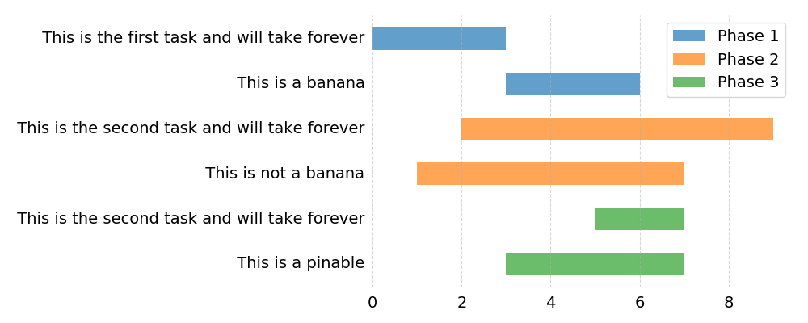

# pygantt

A simple matplotlib-based gantt chart maker.

## Usage

```
pygantt [-h] [-c] [-o OUTPUT] [--width WIDTH] [--height HEIGHT] file

positional arguments:
  file                  Path to sectioned CSV file.

optional arguments:
  -h, --help            show this help message and exit
  -c, --continuous      Whether to keep the program alive and look for file
                        changes every second.
  -o OUTPUT, --output OUTPUT
                        Output filename.
  --width WIDTH         Width of output in inches.
  --height HEIGHT       Height of output in inches.
```

## Example

Write a simple sectioned CSV file:

```csv
*Phase 1
0, 3, This is the first task and will take forever
3, 6, This is a banana

*Phase 2
2, 9, This is the second task and will take forever
1, 7, This is not a banana

*Phase 3
5, 7, This is the second task and will take forever
3, 7, This is a pinable

```

Call pygantt on it:

```bash
python pygant.py test.csv
```

The output is saved to `gantt.png` by default (change it with the `--output` option):


